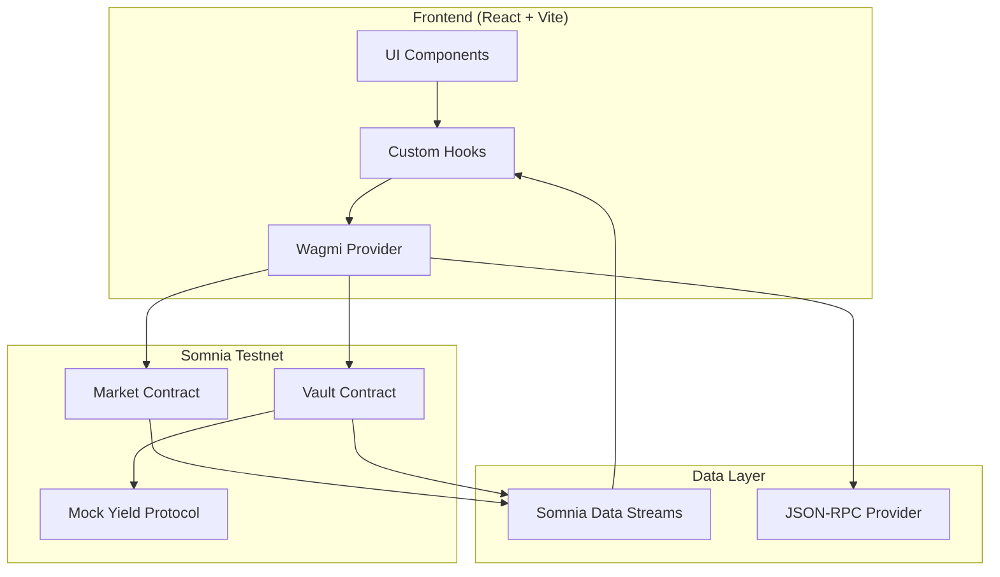

# Design Document

## Overview

This design document outlines the technical implementation for completing the Kinetix Protocol MVP. The implementation focuses on integrating real blockchain functionality into the existing React frontend (Vite + React + Tailwind), including wallet connection via wagmi/viem, smart contract interactions, and Somnia Data Streams (SDS) for real-time updates.

**Important**: All existing UI components (LandingPage, MarketCard, MarketDetail, Portfolio, Navbar, LiveTicker) will be preserved. We only add blockchain integration hooks and update state management to use on-chain data.

## Architecture



## Components and Interfaces

### 1. Wallet Connection Module

```typescript
// config/wagmi.ts
interface WagmiConfig {
  chains: [somniaTestnet];
  connectors: [metaMaskConnector];
  transports: { [chainId]: http(rpcUrl) };
}

// Somnia Testnet Chain Config
interface SomniaTestnet {
  id: 50312; // Somnia Testnet Chain ID
  name: 'Somnia Testnet';
  nativeCurrency: { name: 'STT', symbol: 'STT', decimals: 18 };
  rpcUrls: { default: { http: ['https://dream-rpc.somnia.network'] } };
  blockExplorers: { default: { name: 'Somnia Explorer', url: 'https://somnia-testnet.socialscan.io' } };
}
```

### 2. Contract Interfaces

```typescript
// types/contracts.ts
interface MarketContract {
  // Read functions
  getMarket(marketId: string): Promise<MarketData>;
  getUserPosition(marketId: string, user: Address): Promise<Position>;
  getMarketOdds(marketId: string): Promise<{ yes: bigint; no: bigint }>;
  
  // Write functions
  placeBet(marketId: string, outcome: boolean, amount: bigint): Promise<TxHash>;
  claimWinnings(marketId: string): Promise<TxHash>;
}

interface VaultContract {
  // Read functions
  getTotalLiquidity(marketId: string): Promise<bigint>;
  getYieldGenerated(marketId: string): Promise<bigint>;
  getCurrentAPY(): Promise<bigint>;
  
  // Write functions
  deposit(marketId: string, amount: bigint): Promise<TxHash>;
  withdraw(marketId: string, amount: bigint): Promise<TxHash>;
}

interface Position {
  marketId: string;
  outcome: boolean; // true = YES, false = NO
  amount: bigint;
  timestamp: bigint;
  claimed: boolean;
}
```

### 3. Custom Hooks

```typescript
// hooks/useWallet.ts
interface UseWalletReturn {
  address: Address | undefined;
  isConnected: boolean;
  balance: bigint;
  connect: () => Promise<void>;
  disconnect: () => void;
  switchToSomnia: () => Promise<void>;
}

// hooks/useMarket.ts
interface UseMarketReturn {
  market: Market | null;
  isLoading: boolean;
  placeBet: (outcome: 'YES' | 'NO', amount: string) => Promise<void>;
  isPending: boolean;
  error: Error | null;
}

// hooks/useSDS.ts
interface UseSDSReturn {
  isConnected: boolean;
  lastUpdate: number;
  subscribe: (marketId: string) => void;
  unsubscribe: (marketId: string) => void;
}
```

### 4. Service Layer

```typescript
// services/sdsService.ts
interface SDSService {
  connect(): Promise<void>;
  disconnect(): void;
  subscribeToMarket(marketId: string, callback: (data: MarketUpdate) => void): void;
  subscribeToYield(callback: (data: YieldUpdate) => void): void;
}

interface MarketUpdate {
  marketId: string;
  poolYes: bigint;
  poolNo: bigint;
  totalLiquidity: bigint;
  timestamp: number;
}

interface YieldUpdate {
  marketId: string;
  yieldGenerated: bigint;
  currentAPY: bigint;
  timestamp: number;
}
```

## Data Models

### On-Chain Data Structures

```solidity
// Market struct in Solidity
struct Market {
    string question;
    string description;
    uint256 poolYes;
    uint256 poolNo;
    uint256 endTime;
    MarketStatus status;
    bool outcome; // true = YES won, false = NO won
    address oracle;
}

// Position struct
struct Position {
    uint256 amount;
    bool outcome;
    uint256 timestamp;
    bool claimed;
}

enum MarketStatus {
    Active,
    Resolved,
    Paused
}
```

### Frontend State

```typescript
// Extended UserState
interface UserState {
  isConnected: boolean;
  address: Address | null;
  balance: bigint; // On-chain SOMI balance
  positions: Position[]; // Fetched from contract
  pendingTx: string | null;
}

// Extended Market with on-chain data
interface Market {
  id: string;
  contractAddress: Address;
  question: string;
  description: string;
  poolYes: bigint;
  poolNo: bigint;
  totalLiquidity: bigint;
  yieldGenerated: bigint;
  apy: number;
  endDate: number;
  status: MarketStatus;
  outcome?: boolean; // Set when resolved
  category: string;
  image: string;
  resolutionSource: string;
}
```


## Correctness Properties

*A property is a characteristic or behavior that should hold true across all valid executions of a system-essentially, a formal statement about what the system should do. Properties serve as the bridge between human-readable specifications and machine-verifiable correctness guarantees.*

### Property 1: Address Display Format
*For any* connected wallet address, the displayed address in the navbar SHALL be truncated to format `0x{first4}...{last4}` and the balance SHALL be a non-negative number.
**Validates: Requirements 1.2**

### Property 2: Network Validation
*For any* connected chain ID that is not equal to 50312 (Somnia Testnet), the system SHALL display a network switch prompt.
**Validates: Requirements 1.3**

### Property 3: Disconnect State Reset
*For any* wallet disconnect action, the user state SHALL reset to initial values (isConnected=false, address=null, positions=[]).
**Validates: Requirements 1.4**

### Property 4: Bet Contract Call Integrity
*For any* valid bet submission (amount > 0 AND amount <= balance), the contract placeBet function SHALL be called with correct marketId, outcome boolean, and amount in wei.
**Validates: Requirements 2.1**

### Property 5: Pool Update After Bet
*For any* successful bet transaction of amount X on outcome Y, the corresponding pool (poolYes or poolNo) SHALL increase by exactly X.
**Validates: Requirements 2.3**

### Property 6: Failed Transaction State Preservation
*For any* failed bet transaction, the user balance and market pool sizes SHALL remain unchanged from their pre-transaction values.
**Validates: Requirements 2.4**

### Property 7: Balance Validation
*For any* bet amount greater than user balance, the submit button SHALL be disabled and form submission SHALL be prevented.
**Validates: Requirements 2.5**

### Property 8: Winner Claim Eligibility
*For any* resolved market where user's position outcome matches market outcome, the claim button SHALL be enabled and visible.
**Validates: Requirements 4.1**

### Property 9: Claim Contract Call
*For any* claim action on a winning position, the contract claimWinnings function SHALL be called with the correct marketId.
**Validates: Requirements 4.2**

### Property 10: Claimed Status Update
*For any* successful claim transaction, the position's claimed status SHALL be set to true.
**Validates: Requirements 4.3**

### Property 11: Loser No Claim
*For any* resolved market where user's position outcome does NOT match market outcome, no claim button SHALL be displayed.
**Validates: Requirements 4.4**

### Property 12: Payout Calculation
*For any* winning position with amount A in a market with total winning pool W and total losing pool L and yield Y, the payout SHALL equal A + (A/W * L) + (A/totalPool * Y).
**Validates: Requirements 5.3, 5.4**

### Property 13: Yield Display Calculation
*For any* position with amount A and market APY rate R and duration D days, the estimated yield SHALL equal A * R * D / 365.
**Validates: Requirements 6.2**

### Property 14: Position Win/Loss Status
*For any* resolved market, each position SHALL display "WIN" if position.outcome equals market.outcome, otherwise "LOSS".
**Validates: Requirements 6.3**

## Error Handling

### Wallet Errors
- **Connection Rejected**: Display user-friendly message, allow retry
- **Wrong Network**: Auto-prompt network switch with one-click action
- **Wallet Not Installed**: Show installation link for MetaMask

### Transaction Errors
- **Insufficient Balance**: Pre-validate before submission, show warning
- **Transaction Reverted**: Parse revert reason, display specific error
- **Gas Estimation Failed**: Show generic error, suggest retry
- **User Rejected**: Silent handling, reset pending state

### Network Errors
- **RPC Timeout**: Retry with exponential backoff (3 attempts)
- **SDS Disconnection**: Show indicator, auto-reconnect every 5 seconds
- **Contract Not Found**: Show maintenance message

## Testing Strategy

### Unit Testing
- Use Vitest for React component and hook testing
- Mock wagmi hooks for wallet interaction tests
- Test utility functions for address formatting, amount conversion

### Property-Based Testing
- Use fast-check library for property-based tests
- Focus on:
  - Payout calculation correctness (Property 12)
  - Yield calculation correctness (Property 13)
  - State transitions (Properties 3, 5, 6, 10)
  - Input validation (Property 7)

### Integration Testing
- Test wallet connection flow with mock provider
- Test contract interactions with local hardhat node
- Test SDS subscription/unsubscription lifecycle

### Contract Testing
- Use Hardhat + Chai for Solidity tests
- Test all state transitions
- Test access control
- Test edge cases (zero amounts, max values)
